# marching-squares
> Draw contours in a vector field? NICE! Vector fields are tight.

### Ref:
* [Marching Cubes: A High Resolution 3D Surface Construction Algorithm][3] - by William E. Lorensen , Harvey E. Cline (SIGGRAPH 1987)
<a href="./87_Lorensen_MarchingCubes.pdf">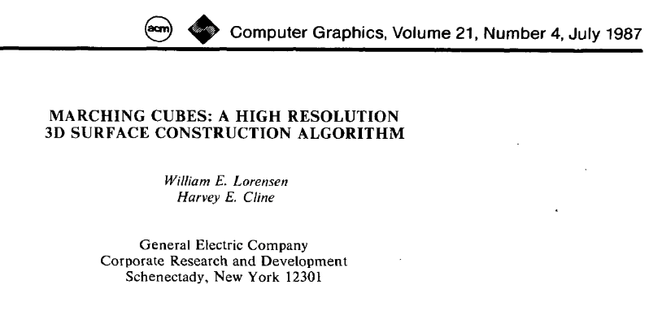</a>
* [Marching Squares Algorithm - Tutorial][1] - Logun Ruf - CKC (2020_11)
* [Coding in the Cabana 5: Marching Squares][2] - Shiffman
* [Meatballs and Marching Squares][4] - Jamie Wong (2014)
* [Marching Squares][5] - Wikipedia
* Sebastian Lague
  * [Coding Adventure: Marching Cubes][6] - vid 
  * [Procedural Cave Generation (E02. Marching Squares)][7] - vid
  * [Marching-Cubes][8] - github repo
* [Marching Squares - HandWiki][10]
* [Marching Cubes][11] - Unice PolyTech
-----------

### Examples:
* [Jacob Zelko - Marching Squares][9]
* [Coding Train - Marching Squares Coding Challenge][12]
* [Mortis GrimReaper - MeatBalls][13]
* [Una Luz - Marching Squares][14]
* [Basi Diomy Cody - k3Beoweuf][15]
* [Joe Wadsorth - Marching-Squares][16]
* [KinecticAtic - Marching Cubes JS][17]

---------
### Snaps
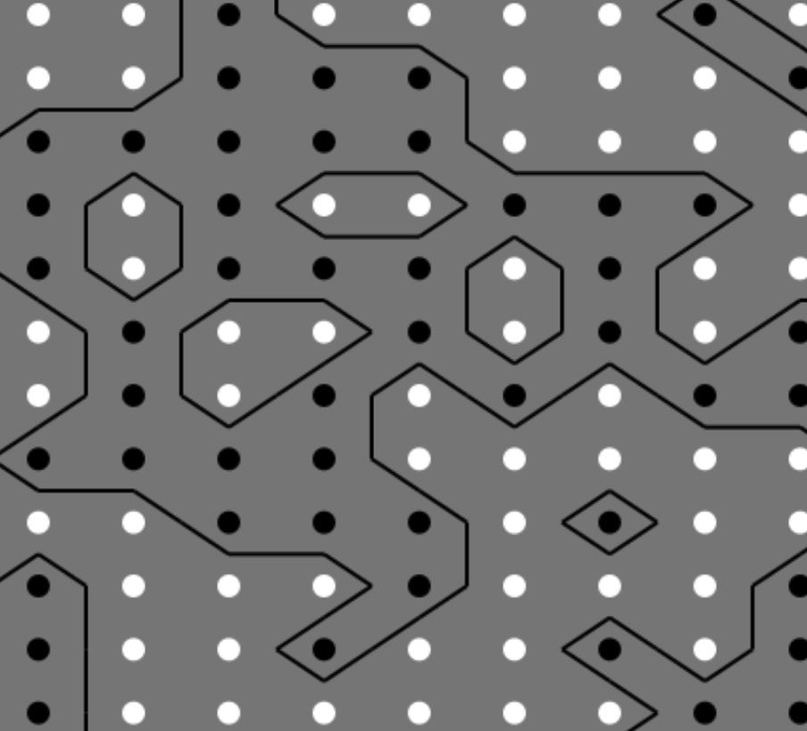
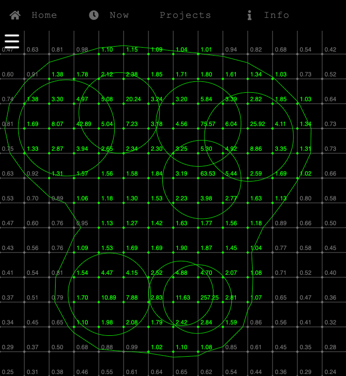
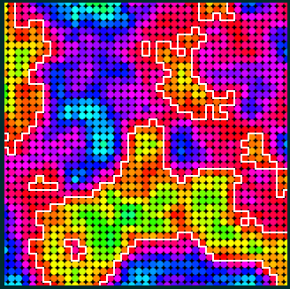
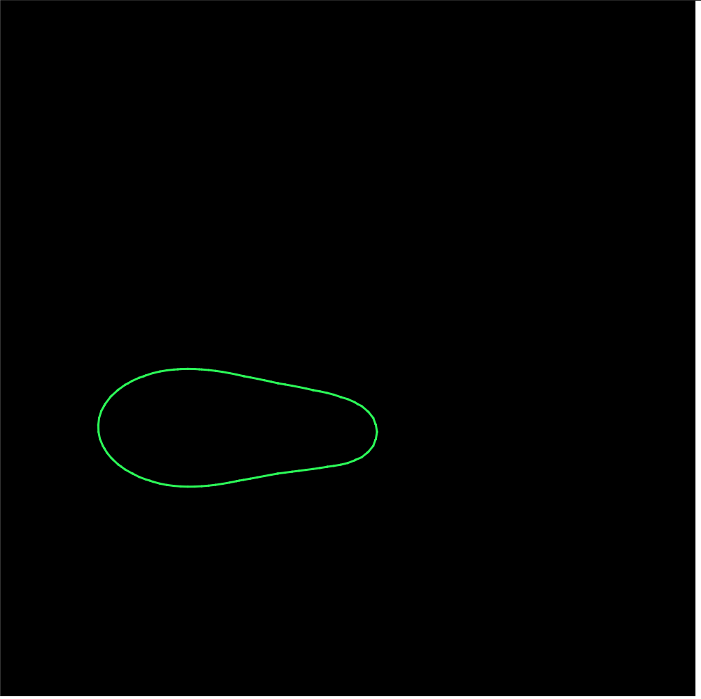
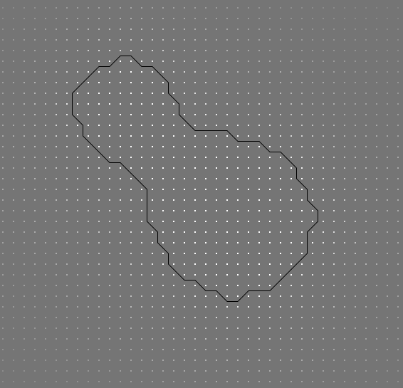
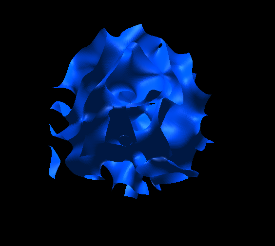
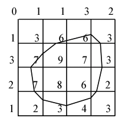
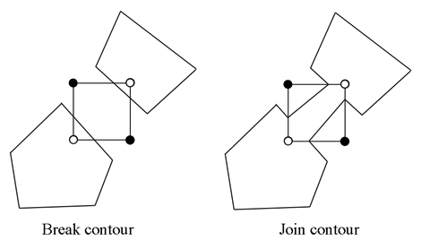
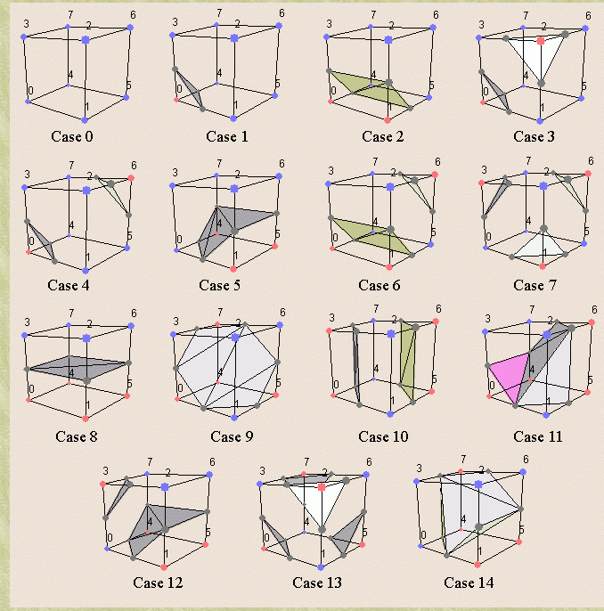
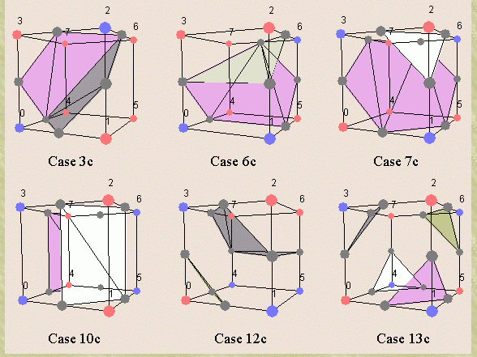

--------
[17]:https://kinetictactic.github.io/marching-cubes-js/
[16]:https://joewadsworth.github.io/Marching-Squares/
[15]:https://editor.p5js.org/BasidiomyCody/present/k3BeoweuV
[14]:https://editor.p5js.org/UnaLuz/full/gGn4TX0Sk
[13]:https://mortis-grimreaper.ddns.net/projects/Metaballs/
[12]:https://thecodingtrain.com/challenges/coding-in-the-cabana/005-marching-squares.html
[11]:http://users.polytech.unice.fr/~lingrand/MarchingCubes/algo.html
[10]:https://handwiki.org/wiki/Marching_squares
[9]:http://jacobzelko.com/marching-squares/
[1]:https://ckcollab.com/2020/11/08/Marching-Squares-Algorithm.html
[2]:https://youtu.be/0ZONMNUKTfU
[3]:https://citeseerx.ist.psu.edu/viewdoc/summary?doi=10.1.1.132.3930
[4]:http://jamie-wong.com/2014/08/19/metaballs-and-marching-squares/
[5]:https://en.wikipedia.org/wiki/Marching_squares
[6]:https://www.youtube.com/watch?v=M3iI2l0ltbE
[7]:https://www.youtube.com/watch?v=yOgIncKp0BE
[8]:https://github.com/SebLague/Marching-Cubes
